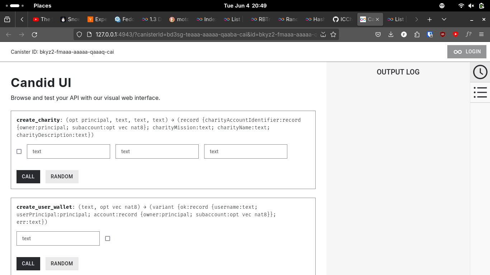

# `caritas`

a small application to help with managing (and donating to) charities, facilitated by the [internet computer](https://internetcomputer.org).

to run, use `make deploy`.

||
|:-:|
||
|_candid ui of the application_|